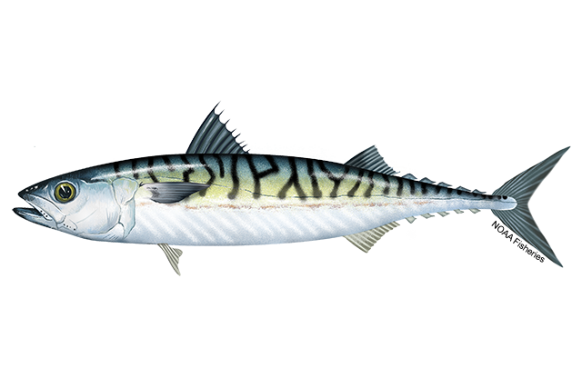

# SPAM: Sampling Program for Atlantic Mackerel

## Overview
The goal of this project is to advance the understanding of atlantic 
mackerel in the northeast region

## Repository contents
The purpose of this repository is to store scripts, visualization tools and 
project management boards for the SPAM team. 

For more information or to contact us, 
visit the [Atlantic Mackerel Cooperative Research Initiative Page](google.com/url?q=https://www.fisheries.noaa.gov/new-england-mid-atlantic/science-data/atlantic-mackerel-cooperative-research-initiative&source=gmail&ust=1786733016964000&usg=AOvVaw0XnanlXKNsLSZO-wp6pyvo)

